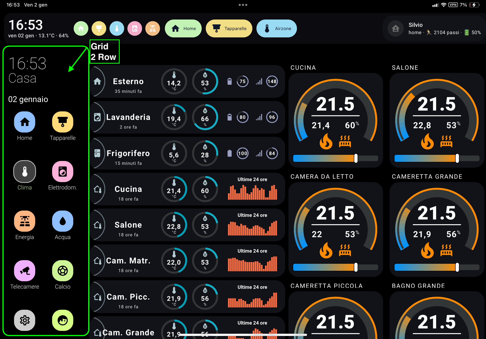
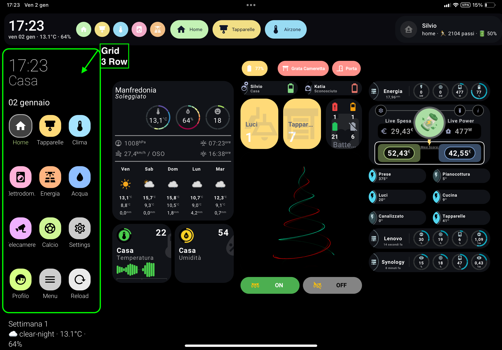
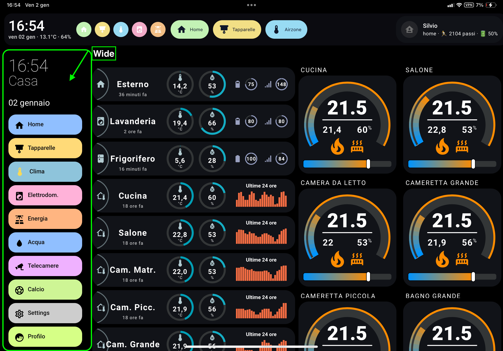
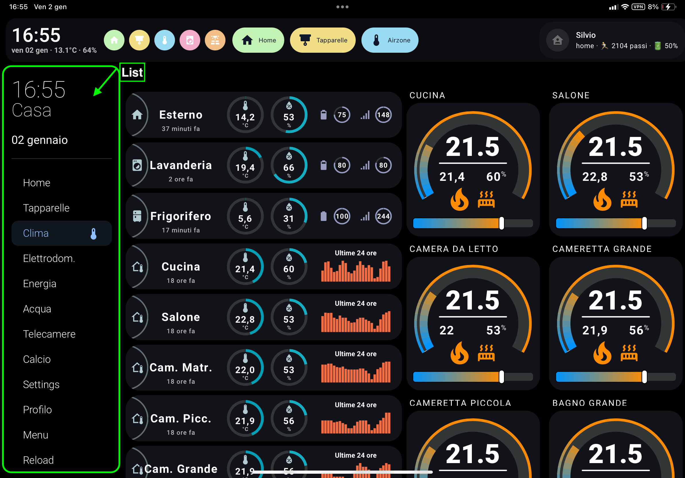
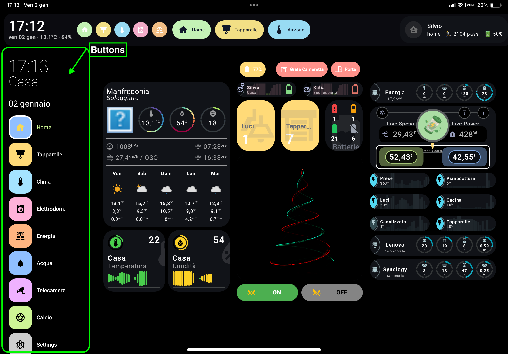
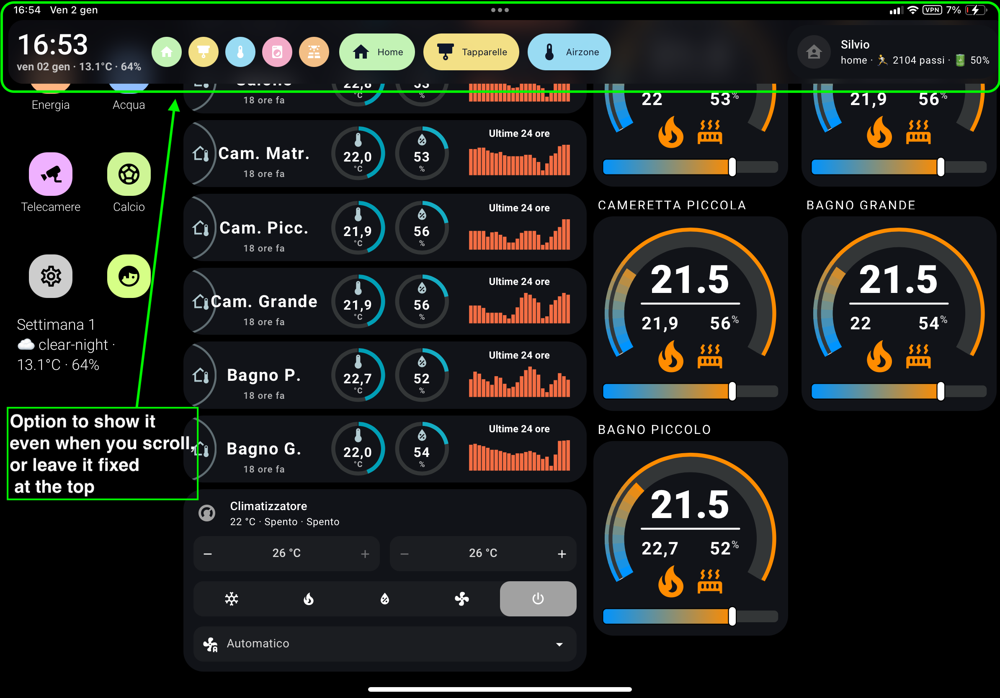

[](https://ko-fi.com/silviosmart)

## Supportami / Support Me

Se ti piace il mio lavoro e vuoi che continui nello sviluppo delle card, puoi offrirmi un caffè.\
If you like my work and want me to continue developing the cards, you can buy me a coffee.


[](https://www.paypal.com/donate/?hosted_button_id=Z6KY9V6BBZ4BN)

Non dimenticare di seguirmi sui social:\
Don't forget to follow me on social media:

[](https://www.tiktok.com/@silviosmartalexa)

[](https://www.instagram.com/silviosmartalexa)

[](https://www.youtube.com/@silviosmartalexa)

# 🧭 Sidebar & Header personalizzati per Home Assistant
[🇬🇧 English](README.md)

## 📸 Screenshot


<p align="center">
  
  
</p>

<p align="center">
  
  
</p>

<p align="center">
  
  
</p>

Sistema **completamente personalizzabile** di **Header + Sidebar** per Home Assistant, moderno, fluido e responsive — compatibile con qualsiasi dashboard Lovelace.

---

## ⭐ Funzionalità

- Sidebar responsive (mobile / tablet / desktop)
- Header fisso con effetto vetro
- **4 stili menu (list / wide / buttons / grid)**
- Voci condizionali
- Colori e icone per singola voce
- Possibilità di nascondere sidebar & top‑bar originali
- Template HTML per messaggi dinamici
- Supporto card personalizzate
- Compatibile con kiosk‑mode
- Sicuro: non modifica il core di Lovelace
- 🆕 **Editor grafico integrato** — configura Sidebar e Header senza toccare lo YAML

---

## 🖊️ Editor Grafico (solo Admin)

Gli amministratori hanno accesso a un **editor visivo integrato** per configurare Sidebar e Header senza modificare manualmente lo YAML.

### Come aprirlo

Due modalità:

1. **Pulsante nella toolbar** — un'icona di modifica dashboard (🖊) appare in alto a destra nella toolbar di HA quando si è loggati come admin. Cliccala per aprire il pannello.
2. **Icona ingranaggio nella sidebar** — un'icona ⚙ in fondo alla sidebar (visibile solo agli admin) apre anch'essa l'editor.

### Tab dell'editor

| Tab | Descrizione |
|-----|-------------|
| **Sidebar** | Larghezza, orologio, formato data, stile menu, voci menu, bottomCard e CSS personalizzato |
| **Header** | Altezza, modalità sticky, topMenuMode, slot card (sinistra / centro / destra), menu e CSS personalizzato |
| **YAML** | Modifica diretta YAML di entrambe le configurazioni — utile per utenti esperti o operazioni copia/incolla |

### Editor card

Tutti i campi card (bottomCard, leftCard, centerCard, rightCard e gli elementi dentro uno stack) usano il **formato YAML** — lo stesso che già usi in Home Assistant. Esempio:

```yaml
type: custom:button-card
entity: light.soggiorno
name: Soggiorno
icon: mdi:sofa
```

### Comportamento del salvataggio

- **Modalità Storage (predefinita)**: le modifiche vengono salvate direttamente in Lovelace tramite WebSocket e la pagina si ricarica automaticamente.
- **Modalità file YAML** (`ui-lovelace.yaml`): l'editor genera uno snippet YAML da copiare nel file di configurazione.

---

# 📦 Installazione

## HACS

Puoi installare l'integrazione premendo direttamente sul tasto

[](https://my.home-assistant.io/redirect/hacs_repository/?owner=bobsilvio&repository=sidebar-card&category=plugin)


---

# 🚀 Configurazione Base

```yaml
sidebar:
  enabled: true
  width: { mobile: 0, tablet: 16, desktop: 18 }

header:
  enabled: true
  sticky: true
  height: 72
```

---

# 🧭 Opzioni Sidebar

| Opzione | Tipo | Default | Descrizione |
|--------|------|---------|-------------|
| enabled | bool | true | abilita sidebar |
| debug | bool | false | log console |
| title | string | "" | titolo opzionale |
| clock | bool | false | orologio analogico |
| digitalClock | bool | false | orologio digitale |
| digitalClockWithSeconds | bool | false | mostra i secondi |
| twelveHourVersion | bool | false | formato 12 ore |
| period | bool | false | mostra AM/PM |
| date | bool | true | mostra data |
| dateFormat | string | DD MMMM | formato data |
| updateMenu | bool | true | evidenzia la voce attiva |
| hideHassSidebar | bool | false | nasconde la sidebar HA |
| hideTopMenu | bool | false | nasconde la barra alta |
| showTopMenuOnMobile | bool | true | mostra top‑bar solo su mobile |
| width | numero/oggetto | 18 | larghezza percentuale |
| breakpoints.mobile | int | 767 | max mobile |
| breakpoints.tablet | int | 1024 | max tablet |
| hideOnPath | lista | — | pagine dove nasconderla |
| menuStyle | string | list | `list / wide / buttons / grid` |
| showLabel | bool | true | mostra il testo |
| template | jinja | — | HTML dinamico |
| bottomCard | card | — | card in fondo |

---

# 📐 Larghezza Responsive

```yaml
width:
  mobile: 0
  tablet: 16
  desktop: 18
```

---

# 📋 Voci Menu Sidebar

```yaml
sidebarMenu:
  - action: navigate
    navigation_path: "/home"
    name: "Home"
    icon: mdi:home
    background_color: "var(--blue)"
    icon_color: "#000"
    text_color: "#000"
```

Azioni supportate: `navigate`, `toggle`, `url`, `more-info`, `call-service`, `service-js`

Campi aggiuntivi:

- `state:` entità per marcare la voce come attiva
- `conditional:` se falso → nasconde la voce

---

# 🎨 Stili Menu

| menuStyle | Descrizione |
|-----------|-------------|
| list | lista semplice |
| wide | **pill lunghe colorate con icona + testo** |
| buttons | bottoni quadrati |
| grid | griglia stile iPhone |

## Esempio stile wide

```yaml
sidebar:
  menuStyle: wide
  showLabel: true
```

```yaml
- action: navigate
  name: "Energia"
  icon: mdi:solar-power-variant
  navigation_path: "/energia"
  background_color: "rgba(255, 200, 140, 0.95)"
  icon_color: "#0f172a"
  text_color: "#0f172a"
```

---

# 🧱 Header

```yaml
header:
  enabled: true
  sticky: true
  height: 72
  headerMenuStyle: wide
  headerMenuShowLabel: true
  headerMenuPosition: center
```

---

# 🎨 Variabili CSS

(identiche a quelle elencate nella versione inglese)

---

# 🛠 Problemi comuni

- svuota la cache browser
- disattiva plugin di layout in conflitto
- prova senza tema grafico

---

# ❤️ Crediti

Creato per la community Home Assistant 🙂

---

## 🔄 Modalità Top Menu Header (NOVITÀ)

La header personalizzata può gestire la top bar di Home Assistant in tre modalità.

| Modalità | Descrizione |
|---------|-------------|
| `overlay` | La top bar HA si sovrappone |
| `push` | Il contenuto viene spinto verso il basso |
| `flip` | **Rotazione cilindrica animata tra header e top bar HA** |

### 🌀 Modalità Flip

La modalità **flip** crea un effetto di rotazione fluido tra:

- La tua header personalizzata
- La top bar originale di Home Assistant

✔ Nessun salto di layout  
✔ Nessuno spostamento delle card  
✔ Spazio sempre identico  

#### Configurazione

```yaml
header:
  enabled: true
  sticky: true
  topMenuMode: flip
  flipDuration: 5   # secondi (opzionale, default: 5)
```

#### Esempio attivazione

```yaml
headerMenu:
  - action: service-js
    name: "Menu"
    icon: mdi:swap-vertical
    service: |
      if (window.silvioFlipTopMenu) {
        window.silvioFlipTopMenu();
      }
```

