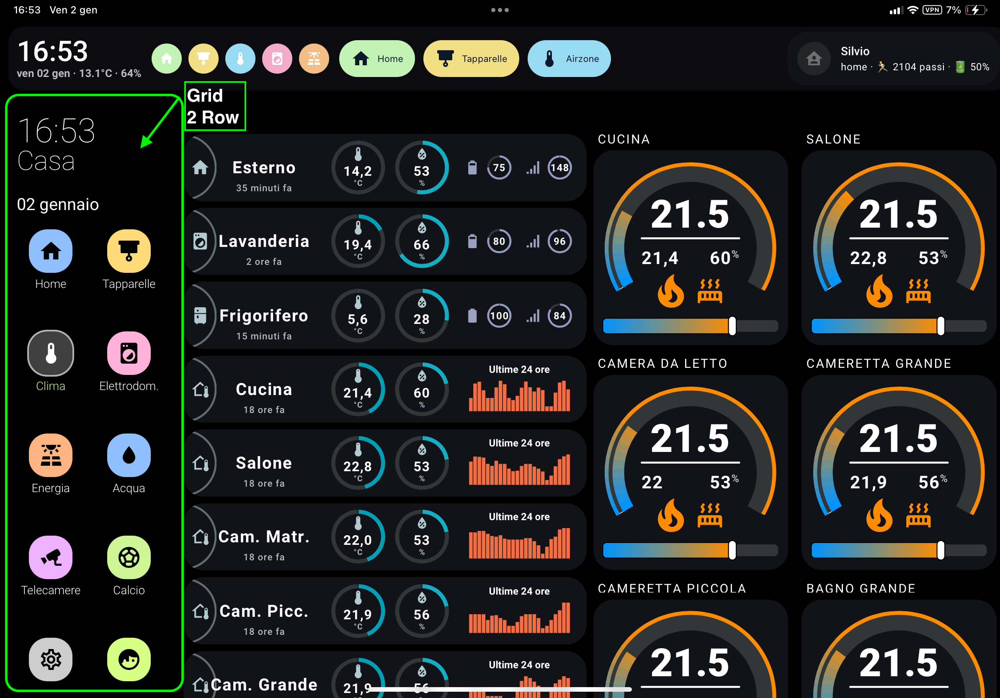
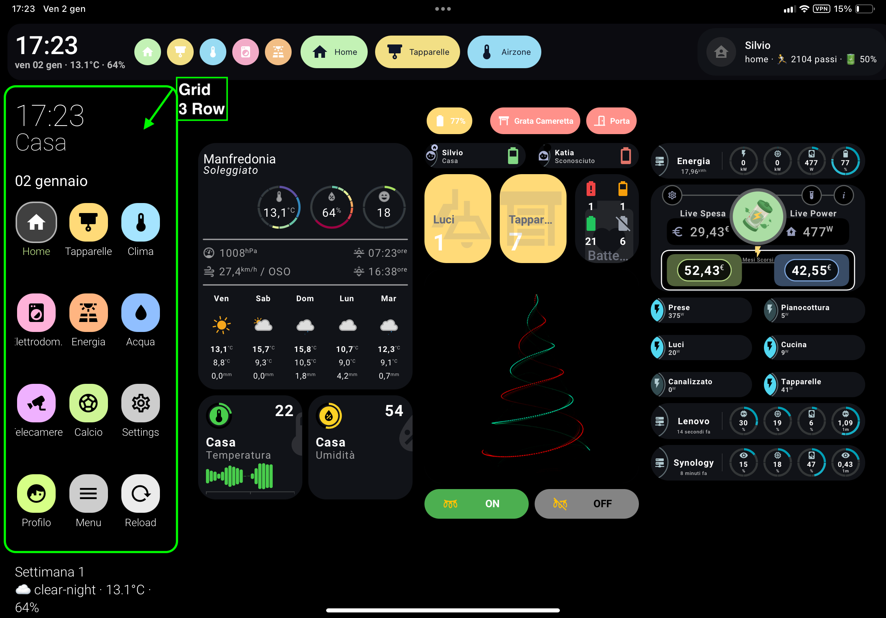
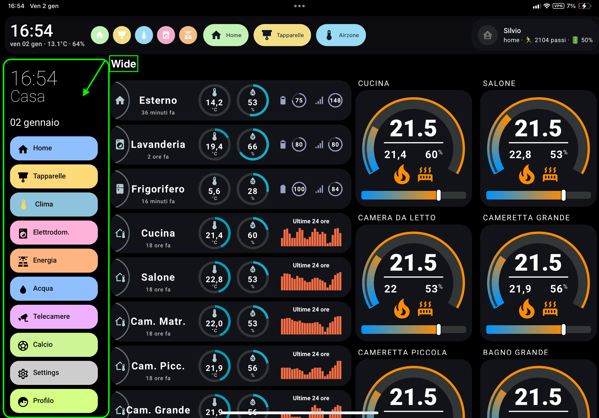
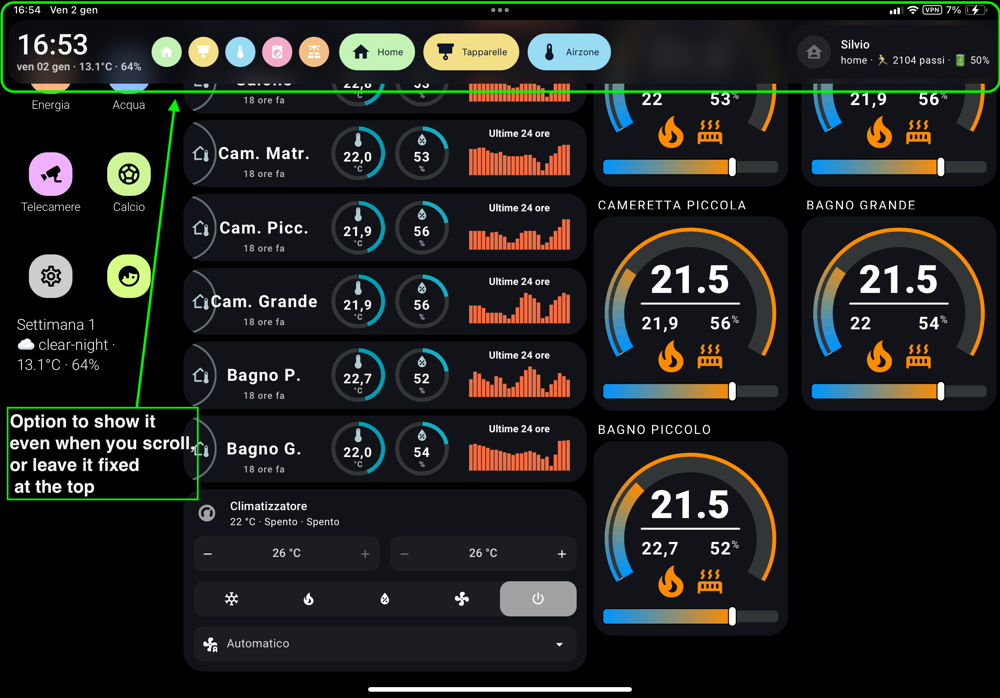

[](https://ko-fi.com/silviosmart)

## Supportami / Support Me

Se ti piace il mio lavoro e vuoi che continui nello sviluppo delle card, puoi offrirmi un caffè.\
If you like my work and want me to continue developing the cards, you can buy me a coffee.


[](https://www.paypal.com/donate/?hosted_button_id=Z6KY9V6BBZ4BN)

Non dimenticare di seguirmi sui social:\
Don't forget to follow me on social media:

[](https://www.tiktok.com/@silviosmartalexa)

[](https://www.instagram.com/silviosmartalexa)

[](https://www.youtube.com/@silviosmartalexa)

# 🧭 Custom Sidebar & Header for Home Assistant
[🇮🇹 Italiano](README.it.md)

## 📸 Screenshots

<p align="center">
  
  
</p>

<p align="center">
  
  
</p>

<p align="center">
  
  
</p>


A fully‑customisable **Header + Sidebar layout system for Home Assistant**, designed to be modern, flexible and responsive — while keeping full compatibility with Lovelace dashboards.

---

## ⭐ Main Features

- Responsive sidebar width (mobile / tablet / desktop)
- Sticky / glass‑style header
- **4 menu styles (list / wide / buttons / grid)**
- Conditional menu items
- Per‑item colors and icons
- Optional hiding of default HA sidebar + top bar
- Template area for greetings / custom HTML
- Supports any Lovelace card inside header & sidebar
- Works with kiosk‑mode setups
- Safe — does **not** hack core Lovelace layout

---

# 📦 Installation

## HACS

This integration can be installed manually or via HACS when available.

[](https://my.home-assistant.io/redirect/hacs_repository/?owner=bobsilvio&repository=sidebar-card&category=plugin)
---

## Manual Install

Copy the JS file to:

```
/config/www/sidebar-card.js
```

Then add the resource:

```yaml
url: /local/sidebar-card.js
type: module
```

Restart or reload resources.

---

# 🚀 Basic Setup

Add to your **dashboard YAML**:

```yaml
sidebar:
  enabled: true
  width: { mobile: 0, tablet: 16, desktop: 18 }

header:
  enabled: true
  sticky: true
  height: 72
```

---

# 🧭 Sidebar Configuration

## 🔧 Main Options

| Option | Type | Default | Description |
|--------|------|---------|-------------|
| `enabled` | bool | `true` | Enables the custom sidebar |
| `debug` | bool | `false` | Log debug messages to console |
| `title` | string | "" | Optional title text |
| `clock` | bool | `false` | Enable analog clock |
| `digitalClock` | bool | `false` | Enable digital clock |
| `digitalClockWithSeconds` | bool | `false` | Show seconds in digital clock |
| `twelveHourVersion` | bool | `false` | 12‑hour clock format |
| `period` | bool | `false` | Show AM / PM when using 12‑hour mode |
| `date` | bool | `true` | Show date |
| `dateFormat` | string | `DD MMMM` | Moment‑style format |
| `updateMenu` | bool | `true` | Highlight active menu item |
| `hideHassSidebar` | bool | `false` | Hide default HA sidebar |
| `hideTopMenu` | bool | `false` | Hide default HA top bar |
| `showTopMenuOnMobile` | bool | `true` | Show top bar only on mobile |
| `width` | number/object | `18` | % width or responsive config |
| `breakpoints.mobile` | int | `767` | Mobile max width |
| `breakpoints.tablet` | int | `1024` | Tablet max width |
| `hideOnPath` | list | — | Paths where sidebar hides |
| `menuStyle` | string | `list` | `list / wide / buttons / grid` |
| `showLabel` | bool | `true` | Show menu text labels |
| `template` | Jinja2 | — | HTML rendered above menu |
| `bottomCard` | Lovelace card | — | Card shown at bottom of sidebar |

---

## 📐 Responsive Width

```yaml
width:
  mobile: 0
  tablet: 16
  desktop: 18
```

---

# 📋 Sidebar Menu Items

```yaml
sidebarMenu:
  - action: navigate
    navigation_path: "/lovelace/home"
    name: "Home"
    icon: mdi:home
    background_color: "var(--blue)"
    icon_color: "#000"
    text_color: "#000"
    state: light.living_room
    conditional: "{{ is_state('alarm_control_panel.house','disarmed') }}"
```

### Actions Supported

| Action | Description |
|--------|-------------|
| `navigate` | Go to a Lovelace view |
| `more-info` | Open entity dialog |
| `toggle` | Toggle entity |
| `call-service` | Call Home Assistant service |
| `service-js` | Execute JavaScript |
| `url` | Open a URL |

### Extra Item Fields

| Field | Description |
|-------|-------------|
| `name` | Label text |
| `icon` | MDI icon |
| `background_color` | Background colour |
| `icon_color` | Icon colour |
| `text_color` | Text colour |
| `state` | Entity used to mark active state |
| `conditional` | When evaluates false → hides the item |

---

# 🎨 Menu Styles

| `menuStyle` | Description |
|-------------|-------------|
| `list` | Simple legacy list style |
| `wide` | **Pill‑style items with icon + label + colored background** |
| `buttons` | Square button style (icon with optional label) |
| `grid` | Compact app‑icon style grid |

## Example — wide style

```yaml
sidebar:
  menuStyle: wide
  showLabel: true
```

```yaml
- action: navigate
  name: "Energy"
  icon: mdi:solar-power-variant
  navigation_path: "/energy"
  background_color: "rgba(255, 200, 140, 0.95)"
  icon_color: "#0f172a"
  text_color: "#0f172a"
```

---

# 🧱 Header Configuration

```yaml
header:
  enabled: true
  sticky: true
  height: 72
  headerMenuStyle: wide
  headerMenuShowLabel: true
  headerMenuPosition: center
```

| Option | Type | Description |
|--------|------|-------------|
| `enabled` | bool | Enable custom header |
| `sticky` | bool | Fix header to top |
| `height` | int | Minimum height (px) |
| `headerMenuStyle` | string | e.g. `wide` |
| `headerMenuShowLabel` | bool | Show label text |
| `headerMenuPosition` | string | `left / center / right` |

---

## Header Menu Items

```yaml
headerMenu:
  - action: navigate
    name: "Home"
    icon: mdi:home
    navigation_path: "/lovelace/home"
    background_color: "rgba(205,255,190,.95)"
    icon_color: "#0f172a"
    text_color: "#0f172a"
```

---

## Header Cards

```yaml
leftCard:
  type: ...
centerCard:
  type: ...
rightCard:
  type: ...
```

Supports **any Lovelace card**.

---

# 🎨 Styling & CSS Variables

Add under the `style:` key, e.g.:

```yaml
style: |
  :host {
```

---

## 🔷 GRID Mode (`menuStyle: grid`)

```
--sidebar-grid-margin-y
--sidebar-grid-gap
--sidebar-grid-item-padding
--sidebar-grid-box-size
--sidebar-grid-radius
--sidebar-grid-bg
--sidebar-grid-icon-size
--sidebar-grid-icon-color
--sidebar-grid-label-margin-top
--sidebar-grid-font-size
--sidebar-grid-line-height
--sidebar-grid-font-weight
--sidebar-grid-text-color
--sidebar-grid-active-border
--sidebar-grid-active-bg
--sidebar-grid-active-icon-color
--sidebar-grid-active-text-color
--sidebar-grid-columns
--sidebar-grid-rows
--sidebar-grid-row-height
```

---

## 🟥 BUTTON Mode (`menuStyle: buttons`)

```
--sidebar-button-margin-y
--sidebar-button-gap
--sidebar-button-item-gap
--sidebar-button-size
--sidebar-button-box-size
--sidebar-button-radius
--sidebar-button-bg
--sidebar-button-icon-color
--sidebar-button-icon-size
--sidebar-button-font-size
--sidebar-button-line-height
--sidebar-button-text-color
--sidebar-button-font-weight
--sidebar-button-active-border-width
--sidebar-button-active-border-color
--sidebar-button-active-shadow-color
--sidebar-button-active-icon-color
--sidebar-button-active-text-color
```

---

## 🟩 WIDE Mode (`menuStyle: wide`)

```
--sidebar-wide-margin-y
--sidebar-wide-gap
--sidebar-wide-padding-x
--sidebar-wide-height
--sidebar-wide-radius
--sidebar-wide-item-gap
--sidebar-wide-bg
--sidebar-wide-icon-color
--sidebar-wide-icon-size
--sidebar-wide-font-size
--sidebar-wide-line-height
--sidebar-wide-text-color
--sidebar-wide-font-weight
--sidebar-wide-active-border-width
--sidebar-wide-active-border-color
--sidebar-wide-active-bg
--sidebar-wide-active-opacity
--sidebar-wide-active-icon-color
--sidebar-wide-active-icon-size
--sidebar-wide-active-text-color
```

---

## 🧠 Common Sidebar Variables

```
--sidebar-selected-bg
--sidebar-icon-color
--primary-text-color
```

---

## 🖼 Header Variables

```
--header-background
--header-backdrop-filter
--header-radius
--header-height
```

---

# 🛠 Troubleshooting

- Disable conflicting layout plugins when testing
- Clear browser cache and reload resources
- Test without theme customisation first

---

# ❤️ Credits
Thanks DBuit for original work

Built for the HA community 🙂

---

## 🔄 Header Top Menu Modes (NEW)

The custom header can manage the Home Assistant top bar in three different ways.

| Mode | Description |
|------|-------------|
| `overlay` | HA top bar overlays the content |
| `push` | Content is pushed down by the HA top bar |
| `flip` | **Animated cylindrical flip between custom header and HA top bar** |

### 🌀 Flip Mode

The **flip mode** creates a smooth cylindrical rotation effect between:

- Your custom header
- The original Home Assistant top bar

✔ No layout jumps  
✔ No content shifting  
✔ Identical occupied space  

#### Configuration

```yaml
header:
  enabled: true
  sticky: true
  topMenuMode: flip
  flipDuration: 5   # seconds (optional, default: 5)
```

#### Trigger example

```yaml
headerMenu:
  - action: service-js
    name: "Top Menu"
    icon: mdi:swap-vertical
    service: |
      if (window.silvioFlipTopMenu) {
        window.silvioFlipTopMenu();
      }
```

